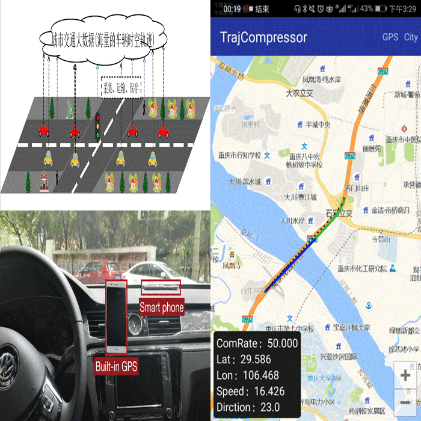
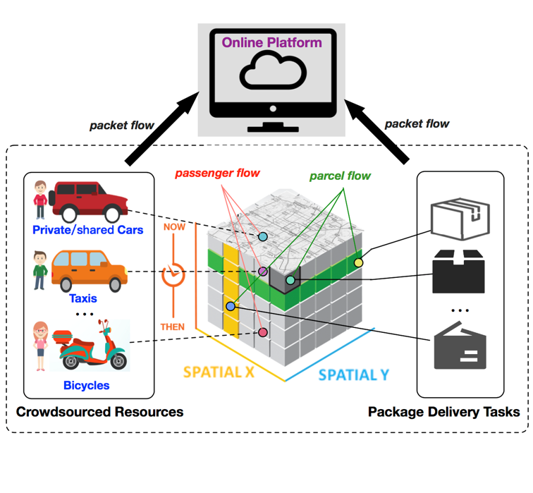
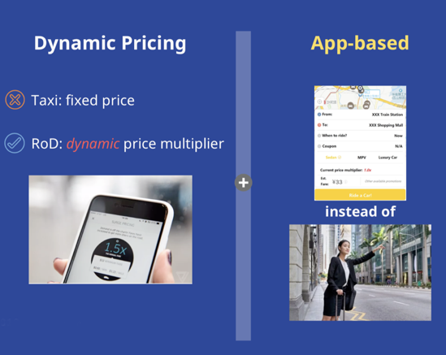
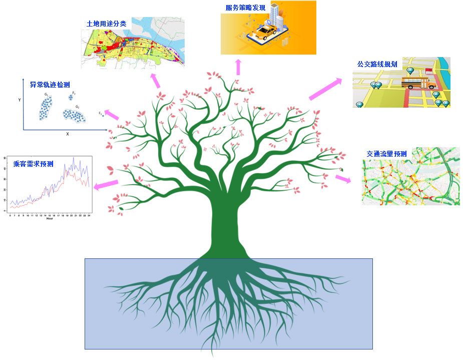

+++
title = "项目"

# View.
#   1 = List
#   2 = Compact
#   3 = Card
#   4 = Citation
view = 3

# Optional featured image (relative to `static/img/` folder).
[header]
image = ""
caption = ""
+++

<html>

    

      

          
      

      

        <h3 class="mb-0 text-dark"><strong>轨迹数据压缩</strong></h3>
        
This is a wider card with supporting text below as a natural lead-in to additional content.

        <!-- 
Nov 12
 -->
        
example

        <h4 class="mb-1">paper</h4>
        <ul>
          <li class="card-text mb-auto">1</li>
          <li class="card-text mb-auto">2</li>
          <li class="card-text mb-auto">3</li>
        </ul> 
        <!-- <a href="#" class="stretched-link">更多</a> -->
      

    
  

    

      

          
      

      

        <h3 class="mb-0 text-dark"><strong>群智物流</strong></h3>
        
This is a wider card with supporting text below as a natural lead-in to additional content.

        <!-- 
Nov 12
 -->
        
example

        <h4 class="mb-1">paper</h4>
        <ul>
          <li class="card-text mb-auto">1</li>
          <li class="card-text mb-auto">2</li>
          <li class="card-text mb-auto">3</li>
        </ul> 
        <!-- <a href="#" class="stretched-link">更多</a> -->
      

    
  

    

      

          
      

      

        <h3 class="mb-0 text-dark"><strong>智能路径计算</strong></h3>
        
This is a wider card with supporting text below as a natural lead-in to additional content.

        <!-- 
Nov 12
 -->
        
example

        <h4 class="mb-1">paper</h4>
        <ul>
          <li class="card-text mb-auto">1</li>
          <li class="card-text mb-auto">2</li>
          <li class="card-text mb-auto">3</li>
        </ul> 
        <!-- <a href="#" class="stretched-link">更多</a> -->
      

    
  

    

      

          
      

      

        <h3 class="mb-0 text-dark"><strong>智能移动出行</strong></h3>
        
This is a wider card with supporting text below as a natural lead-in to additional content.

        <!-- 
Nov 12
 -->
        
example

        <h4 class="mb-1">paper</h4>
        <ul>
          <li class="card-text mb-auto">1</li>
          <li class="card-text mb-auto">2</li>
          <li class="card-text mb-auto">3</li>
        </ul> 
        <!-- <a href="#" class="stretched-link">更多</a> -->
      

    
  

    

      

          
      

      

        <h3 class="mb-0 text-dark"><strong>智能城市服务</strong></h3>
        
This is a wider card with supporting text below as a natural lead-in to additional content.

        <!-- 
Nov 12
 -->
        
example

        <h4 class="mb-1">paper</h4>
        <ul>
          <li class="card-text mb-auto">1</li>
          <li class="card-text mb-auto">2</li>
          <li class="card-text mb-auto">3</li>
        </ul> 
        <!-- <a href="#" class="stretched-link">更多</a> -->
      

    
  

</html>
